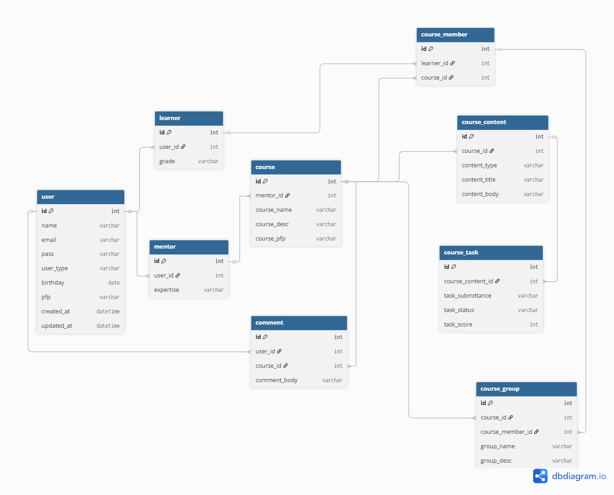

<p align="center">
  
</p>

<a id="readme-id"></a>

# STUDYO - Your Studio for Studying

> Everything here is in **Indonesian** language. <br>
> Go [here](#readme-eng) to read this in **English**!

Aplikasi *Learning Management System* (LMS) ini bernama `Studyo`, memadukan istilah **Studio** dan **Study** yang berarti sebuah studio untuk melangsungkan aktivitas pembelajaran. Aplikasi ini akan menjadi salah satu alat yang memudahkan proses pembelajaran yang terjadi antara pengajar (dalam aplikasi disebut *Mentor*) dengan peserta ajar (dalam aplikasi disebut *Learner*). Pengguna yang memegang peran `mentor` dapat **menambahkan materi pada kelas yang ia pegang**, **memberikan tugas kepada learner**, **menilai hasil pekerjaan learner**, serta **membagi para learner dalam satu kelas menjadi sejumlah group kecil**. Sementara itu, pengguna yang berperan sebagai `learner` dapat **mengakses berbagai materi yang tersedia dalam kelas yang diikuti**, **mengumpulkan tugas yang diberikan oleh mentor**, dan **menerima nilai hasil pemeriksaan mentor terhadap pekerjaan yang dikumpulkan**. Para pengguna dalam satu kelas juga dapat **berkomunikasi** menggunakan fitur `comment`, baik bagi mentor maupun learner agar terjadi komunikasi dari berbagai arah dengan efektif.

<p align="center">
  
</p>

<p align="center">
  
  
  
  <br>
  
  
  
  
  
  
  <br>
  
  
</p>

---

## Tentang Kreator

<p align="center">
  
</p>

Studyo dirancang dan dibangun oleh **David Christian Siringoringo** (*2422121747*), seorang mahasiswa jurusan Teknik Informatika Universitas IBBI sebagai pemenuhan *final project* pada mata kuliah *Web Programming II* di semester 4.

---

## Fitur

<p align="center">
  
</p>

### ⚙️ Tersedia

| Fitur | Izin Akses |
|-------|-------|
| **Autentikasi & Sesi** — Login, logout, reset password via email | - |
| **Akses Berbasis Peran** — Tiga peran: admin, mentor, learner | - |
| **Manajemen Admin** — CRUD data admin | *Admin* |
| **Manajemen Mentor** — CRUD data mentor | *Admin* |
| **Manajemen Learner** — CRUD data learner | *Admin* |
| **Manajemen Kursus** — CRUD data kursus | *Admin* |
| **Peserta Kursus** — Pendaftaran learner ke dalam kursus | *Learner* |
| **Konten Kursus** - Penambahan materi dan tugas dalam kursus | *Mentor* |
| **Grup Kursus** - Pembentukan grup dalam kursus | *Mentor* |
| **Komentar** - Setiap pengguna mampu berkomunikasi di kolom komentar | *Mentor & Learner* |
| **Pengumpulan Tugas** - Upload file pada konten tugas | *Learner* |
| **Penilaian Tugas** - Pemberian skor/nilai pada masing-masing tugas yang diserahkan | *Mentor* |
| **Email Notifikasi** — Email kredensial akun & reset password | - |
| **Validasi Input** — Validasi lengkap di setiap form | - |
| **Keamanan** — bcrypt + prepared statements + session | - |

### 🛠️ Dalam Pengembangan

| Fitur |
|-------|
| **Editor Teks** — Pembuatan tampilan deskripsi konten kursus yang lebih variatif |
| **Penugasan Kelompok** — Pemberian tugas pada masing-masing kelompok dalam kursus |

---

## Quick Start

<p align="center">
  
</p>

```bash
# Masuk ke dalam direktori Studyo
cd studyo

# Install semua dependencies
npm install

# Inisialisasi database
npm run createdb

# Seed database (opsional)
npm run filldb

# Jalankan server (port 3000)
npm run app
```

Buka [http://localhost:3000](http://localhost:3000) di browser.

### 🔒 Contoh Akun Login

| **Akses** | **Email** | **Password** |
|-------|-------|-------|
| *Admin* | admin1@studyo.com | `admin1@studyo.com` |
| *Mentor* | mentor1@studyo.com | `mentor1@studyo.com` |
| *Learner* | learner1@studyo.com | `learner1@studyo.com` |

### ✉️ Konfigurasi Email (Opsional)

Isi kredensial email ke file `.env`. Contoh:

```env
EMAIL_HOST=smtp.gmail.com
EMAIL_PORT=587
EMAIL_USER=emailsample@studyo.com
EMAIL_PASSWORD=password-example
APP_URL=http://localhost:3000
```

Email digunakan untuk mengirim kredensial akun baru & reset password.

---

## Arsitektur

<p align="center">
  
</p>

### 🤖 Stack

| Layer | Teknologi |
|-------|-----------|
| **Backend** | Express.js v5.2.1 |
| **Template Engine** | Handlebars (express-handlebars v8.0.4) |
| **Database** | SQLite (better-sqlite3 v12.11.1) |
| **CSS** | CSS + Bootstrap v5.3.8 |
| **Auth** | bcrypt v6.0.0 + express-session v1.19.0 |

### 🪾 Struktur MVC

```
studyo/
├── config/                  # Konfigurasi (email, multer)
├── controllers/             # Validasi, logika bisnis, render view
├── database/                # Koneksi SQLite & seeding database
├── middlewares/             # Auth middleware
├── models/                  # Query database
├── routes/                  # Routing HTTP → controller
├── views/                   # Template Engine
│   ├── layouts/             # Layout utama (main.hbs & auth.hbs)
│   └── pages/               # Halaman per modul atau fitur
│   └── partials/               # Komponen spesifik halaman
├── index.js                 # Entry point aplikasi
├── .env
└── package.json
```

---

## Skema Database

<p align="center">
  
</p>

9 tabel dengan foreign key relationships:

```
user (email, pass, user_type, birthday, pfp)
  ├── mentor (expertise)
  ├── learner (grade)
  ├── course (course_name, course_desc, course_pfp)
  ├── course_content (content_type, content_title, content_body)
  ├── course_task (task_submittance, task_status, task_score)
  ├── course_member
  ├── course_group (group_name)
  └── comment (comment_body)
```

Lihat selengkapnya pada [studyo_erd.dbml](./studyo_erd.dbml).

---

## Scripts

<p align="center">
  
</p>

| Script | Perintah | Fungsi |
|--------|----------|--------|
| **app** | `npm run app` | Jalankan server dengan auto-reload dari nodemon |
| **createdb** | `npm run createdb` | Reset & inisialisasi ulang database (database akan dihapus total!) |
| **filldb** | `npm run filldb` | Isi database dengan data sample |

---

## Navigasi

<p align="center">
  
</p>

| Route | Halaman |
|-------|---------|
| `/auth/login` | Login |
| `/auth/forget-pass` | Lupa password |
| `/` | Halaman utama |
| `/mentor/list` | Manajemen mentor |
| `/learner/list` | Manajemen learner |
| `/admin/list` | Manajemen admin |
| `/course/list` | Manajemen kursus |
| `/course/:id/detail` | Detail kursus |
| `/profile/bio` | Profil pengguna |

### 🔐 Password Default

| Default |
|---------|
| sama dengan alamat **Email** |

---

## Aturan Kode

<p align="center">
  
</p>

### 🌐 Bahasa Program

Seluruh kode — variabel, fungsi, komentar, UI — menggunakan **Bahasa Inggris**.

| Prefix | Example
|--------|--------|
| `fetch*` / `get*` | `fetchAllLearners()` |
| `create*` / `add*` | `createLearner()` |
| `update*` | `updateLearner()` |
| `delete*` | `deleteLearner()` |
| `show*` | `showCreateLearner()` |
| `run*` | `showCreateLearner()` |
| `show*` | `showCreateLearner()` |
| `handle*` | `handleLogin()` |
| `send*` | `sendPassResetEmail()` |
| `*Message` | `errorMessage`, `successMessage` |

### 🔤 Aturan Penamaan

| Scope | Style | Contoh |
|-------|-------|--------|
| **JavaScript** | camelCase | `mentorId`, `showCreateMentor` |
| **Database** | snake_case | `user_id`, `course_content` |
| **Routes** | kebab-case | `/auth/forget-pass` |

---

## Keamanan

<p align="center">
  
</p>

- **Autentikasi Sesi** — Cookie sesi dengan masa berlaku 1 jam
- **Enkripsi Password** — Menggunakan bcrypt (salt rounds = 10)
- **Injeksi SQL** — Prepared statements di semua query
- **Validasi Input** — Validasi ketat di controllers sebelum operasi dengan Database
- **Foreign Keys** — ON DELETE CASCADE pada Database untuk integritas data
- **Middleware Autentikasi & Authorisasi** — Setiap route eksklusif dilindungi middleware autentikasi dan authorisasi

---

## Tambah Modul Baru

<p align="center">
  
</p>

```bash
# Buat model baru
touch models/[Name].js

# Buat controller baru
touch controllers/[name]Controller.js

# Buat routes baru
touch routes/[nama]Routes.js

# Buat view files
mkdir -p views/pages/[name]
touch views/pages/[name]/create.hbs
touch views/pages/[name]/list.hbs
touch views/pages/[name]/edit.hbs

# Register di index.js
```

Pola route:

```javascript
router.get("/create", Controller.showCreateForm);
router.post("/create", Controller.createEntity);
router.get("/list", Controller.listEntity);
router.get("/edit/:id", Controller.showEditForm);
router.post("/edit/:id", Controller.editEntity);
router.post("/delete/:id", Controller.deleteEntity);
```
**Pola bisa berbeda untuk route yang bertingkat (contoh: /:id/detail)**

---

## Kontribusi

<p align="center">
  
</p>

1. Fork repositori ini
2. Buat branch untuk fitur baru: `git checkout -b feature/something-cool`
3. Commit perubahan: `git commit -m "feat: add something cool"`
4. Push: `git push origin feature/something-cool`
5. Ajukan Pull Request

**Mari berkarya bersama!**

---

## Hak Cipta

<p align="center">
  
</p>

<p align="center">
  <strong>Copyright © Studyo 2026.</strong>
</p>

---

<p align="center">
  
</p>

<a id="readme-eng"></a>

# STUDYO - Your Studio for Studying

> Everything below is the **English** version of this README.<br>
> Kembali ke [sini](#readme-id) untuk membacanya dalam bahasa **Indonesia**!

This Learning Management System (LMS) application is called `Studyo`, combining the terms **Studio** and **Study** to represent a studio where learning activities take place. This application is designed as a tool to simplify the learning process between instructors (called *Mentors* in this application) and students (called *Learners*). Users with the `mentor` role can **add materials to their classes**, **assign tasks to learners**, **grade learner submissions**, and **divide learners in one class into smaller groups**. Meanwhile, users with the `learner` role can **access available class materials**, **submit assigned tasks**, and **receive grades from mentor evaluations**. Users in the same class can also **communicate** through the `comment` feature, enabling effective two-way and multi-directional communication for both mentors and learners.

<p align="center">
  
</p>

<p align="center">
  
  
  
  <br>
  
  
  
  
  
  
  <br>
  
  
</p>

---

## About the Creator

<p align="center">
  
</p>

Studyo was designed and built by **David Christian Siringoringo** (*2422121747*), an Informatics Engineering student at Universitas IBBI, as a final project submission for the *Web Programming II* course in 4th Semester.

---

## Features

<p align="center">
  
</p>

### ⚙️ Available

| Feature | Access Permission |
|-------|-------|
| **Authentication & Session** — Login, logout, password reset via email | - |
| **Role-Based Access** — Three roles: admin, mentor, learner | - |
| **Admin Management** — Admin data CRUD | *Admin* |
| **Mentor Management** — Mentor data CRUD | *Admin* |
| **Learner Management** — Learner data CRUD | *Admin* |
| **Course Management** — Course data CRUD | *Admin* |
| **Course Enrollment** — Learner enrollment into courses | *Learner* |
| **Course Content** — Add materials and tasks to courses | *Mentor* |
| **Course Grouping** — Create groups within a course | *Mentor* |
| **Comments** — All users can communicate in the comment section | *Mentor & Learner* |
| **Task Submission** — Upload files for task content | *Learner* |
| **Task Grading** — Assign scores to each submitted task | *Mentor* |
| **Email Notifications** — New account credentials & password reset emails | - |
| **Input Validation** — Comprehensive validation on every form | - |
| **Security** — bcrypt + prepared statements + session | - |

### 🛠️ Under Development

| Feature |
|-------|
| **Text Editor** — Richer and more flexible course content description display |
| **Group Assignments** — Assign tasks to each group within a course |

---

## Quick Start

<p align="center">
  
</p>

```bash
# Enter the Studyo directory
cd studyo

# Install all dependencies
npm install

# Initialize the database
npm run createdb

# Seed the database (optional)
npm run filldb

# Run the server (port 3000)
npm run app
```

Open [http://localhost:3000](http://localhost:3000) in your browser.

### 🔒 Sample Login Accounts

| **Access** | **Email** | **Password** |
|-------|-------|-------|
| *Admin* | admin1@studyo.com | `admin1@studyo.com` |
| *Mentor* | mentor1@studyo.com | `mentor1@studyo.com` |
| *Learner* | learner1@studyo.com | `learner1@studyo.com` |

### ✉️ Email Configuration (Optional)

Fill in your email credentials in the `.env` file. Example:

```env
EMAIL_HOST=smtp.gmail.com
EMAIL_PORT=587
EMAIL_USER=emailsample@studyo.com
EMAIL_PASSWORD=password-example
APP_URL=http://localhost:3000
```

Email is used to send new account credentials and password reset messages.

---

## Architecture

<p align="center">
  
</p>

### 🤖 Stack

| Layer | Technology |
|-------|-----------|
| **Backend** | Express.js v5.2.1 |
| **Template Engine** | Handlebars (express-handlebars v8.0.4) |
| **Database** | SQLite (better-sqlite3 v12.11.1) |
| **CSS** | CSS + Bootstrap v5.3.8 |
| **Auth** | bcrypt v6.0.0 + express-session v1.19.0 |

### 🪾 MVC Structure

```
studyo/
├── config/                  # Configuration (email, multer)
├── controllers/             # Validation, business logic, view rendering
├── database/                # SQLite connection & database seeding
├── middlewares/             # Auth middleware
├── models/                  # Database queries
├── routes/                  # HTTP routing → controller
├── views/                   # Template Engine
│   ├── layouts/             # Main layouts (main.hbs & auth.hbs)
│   └── pages/               # Pages by module or feature
│   └── partials/            # Reusable page-specific components
├── index.js                 # Application entry point
├── .env
└── package.json
```

---

## Database Schema

<p align="center">
  
</p>

9 tables with foreign key relationships:

```
user (email, pass, user_type, birthday, pfp)
  ├── mentor (expertise)
  ├── learner (grade)
  ├── course (course_name, course_desc, course_pfp)
  ├── course_content (content_type, content_title, content_body)
  ├── course_task (task_submittance, task_status, task_score)
  ├── course_member
  ├── course_group (group_name)
  └── comment (comment_body)
```

See full details in [studyo_erd.dbml](./studyo_erd.dbml).

---

## Scripts

<p align="center">
  
</p>

| Script | Command | Function |
|--------|----------|--------|
| **app** | `npm run app` | Run the server with nodemon auto-reload |
| **createdb** | `npm run createdb` | Reset & reinitialize the database (the database will be fully deleted!) |
| **filldb** | `npm run filldb` | Populate the database with sample data |

---

## Navigation

<p align="center">
  
</p>

| Route | Page |
|-------|---------|
| `/auth/login` | Login |
| `/auth/forget-pass` | Forgot password |
| `/` | Home page |
| `/mentor/list` | Mentor management |
| `/learner/list` | Learner management |
| `/admin/list` | Admin management |
| `/course/list` | Course management |
| `/course/:id/detail` | Course detail |
| `/profile/bio` | User profile |

### 🔐 Default Password

| Default |
|---------|
| same as the **Email** address |

---

## Code Convention

<p align="center">
  
</p>

### 🌐 Programming Language

All code elements — variables, functions, comments, and UI text — use **English**.

| Prefix | Example
|--------|--------|
| `fetch*` / `get*` | `fetchAllLearners()` |
| `create*` / `add*` | `createLearner()` |
| `update*` | `updateLearner()` |
| `delete*` | `deleteLearner()` |
| `show*` | `showCreateLearner()` |
| `run*` | `showCreateLearner()` |
| `show*` | `showCreateLearner()` |
| `handle*` | `handleLogin()` |
| `send*` | `sendPassResetEmail()` |
| `*Message` | `errorMessage`, `successMessage` |

### 🔤 Naming Conventions

| Scope | Style | Example |
|-------|-------|--------|
| **JavaScript** | camelCase | `mentorId`, `showCreateMentor` |
| **Database** | snake_case | `user_id`, `course_content` |
| **Routes** | kebab-case | `/auth/forget-pass` |

---

## Security

<p align="center">
  
</p>

- **Session Authentication** — Session cookie with a 1-hour lifetime
- **Password Encryption** — Uses bcrypt (salt rounds = 10)
- **SQL Injection Protection** — Prepared statements for all queries
- **Input Validation** — Strict validation in controllers before database operations
- **Foreign Keys** — ON DELETE CASCADE in the database for data integrity
- **Authentication & Authorization Middleware** — Every exclusive route is protected by authentication and authorization middleware

---

## Add New Module

<p align="center">
  
</p>

```bash
# Create a new model
touch models/[Name].js

# Create a new controller
touch controllers/[name]Controller.js

# Create new routes
touch routes/[name]Routes.js

# Create view files
mkdir -p views/pages/[name]
touch views/pages/[name]/create.hbs
touch views/pages/[name]/list.hbs
touch views/pages/[name]/edit.hbs

# Register in index.js
```

Route pattern:

```javascript
router.get("/create", Controller.showCreateForm);
router.post("/create", Controller.createEntity);
router.get("/list", Controller.listEntity);
router.get("/edit/:id", Controller.showEditForm);
router.post("/edit/:id", Controller.editEntity);
router.post("/delete/:id", Controller.deleteEntity);
```

**The pattern may differ for nested routes (example: /:id/detail).**

---

## Contribution

<p align="center">
  
</p>

1. Fork this repository
2. Create a branch for a new feature: `git checkout -b feature/something-cool`
3. Commit your changes: `git commit -m "feat: add something cool"`
4. Push: `git push origin feature/something-cool`
5. Submit a Pull Request

**Let's build great things together!**

---

## Copyright

<p align="center">
  
</p>

<p align="center">
  <strong>Copyright © Studyo 2026.</strong>
</p>

---